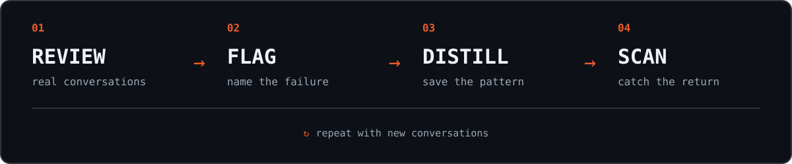
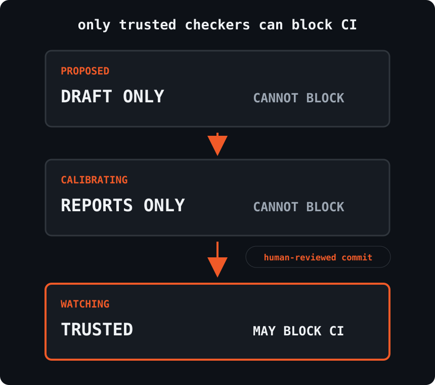

# 🚩 antibody

[](https://www.npmjs.com/package/antibody)
[](https://github.com/r3dbars/antibody/actions/workflows/test.yml)
[](LICENSE)

**Turn an AI failure into a permanent regression test.** Discover failures in
real traces, reproduce them as executable quizzes, and block them from coming
back.

Your tests catch deterministic bugs. Antibody catches recurring AI behavior you
never want to ship again: fabricated facts, ignored instructions, broken tool
use, unhelpful refusals, or whatever *you* decide is wrong.

Antibody is a small CLI and a `.antibody/` folder in your repo. It has two
loops: discovery finds recurring mistakes in real traces; immunization runs the
actual product against durable regression quizzes.

## Use it with your coding agent

Ask Claude Code, Codex, or another coding agent:

> Use Antibody to check my support agent before I merge.


The included [`skills/`](skills/) teach the coding agent how to review traces,
grow the failure registry, investigate matches, and fix regressions without
taking judgment away from you.

Want to see the keyless CLI demo instead? It runs in a throwaway folder:

```sh
npx antibody demo
```

## The two loops

```text
Discovery:    import → review → flag → distill → calibrate → scan
Immunization: capture → reproduce → quiz → fix → prove → gate
```

The discovery loop answers, “What kinds of mistakes does this product make in
the real world?” The immunization loop answers, “Can this version of the
product avoid a known failure?”

The human still defines what is bad. A trace is evidence, not automatically a
test. A new quiz must prove the known-bad revision fails and the candidate
passes before it can become a trusted gate.

## Discover failures

<picture>
  <source media="(max-width: 600px)" srcset="assets/working-loop-mobile.svg">
  
</picture>

1. **Review** conversations your application actually produced.
2. **Flag** a bad one and explain the problem in your own words.
3. **Distill** repeated flags into a named, reviewable failure pattern.
4. **Scan** new conversations and fail CI when a trusted failure returns.

If you know regression testing, you already know the mental model:

| Software testing | Antibody |
|---|---|
| A bug report | A flagged conversation |
| A regression test | A failure pattern |
| Test fixtures | Reviewed traces |
| The test suite | The failure registry |
| A failing build | A known behavior returned |

Antibody does not decide what “good AI” means. You make that call; Antibody
helps you remember it.

## Immunize the product

A product adapter runs one case through the real product and returns structured
JSON. A quiz applies small deterministic assertions to that result. Antibody
does not care whether the product uses Swift, Python, TypeScript, or something
else.

```text
.antibody/
├── product.yml            # how to run this product
├── quizzes/               # reproducible inputs + expected contracts
└── suites/                # report-only or blocking collections
```

Every regression should include a nearby healthy control. This prevents broad
fixes such as avoiding fabricated dates by never mentioning dates at all.

```sh
antibody quiz validate                 # check the committed contracts
antibody test                          # run report-only and blocking quizzes
antibody test --compare origin/main    # prove base fails and branch passes
antibody gate --ci                     # run human-promoted blocking quizzes
```

Exit `1` means a product regression. Exit `2` means Antibody could not evaluate
the product. Both block a merge; a broken harness never masquerades as a pass.

The contracts are documented in [`spec/product-adapter.md`](spec/product-adapter.md)
and [`spec/quiz.md`](spec/quiz.md). The ten binding rules are in
[`spec/philosophy.md`](spec/philosophy.md).

## Use it on your agent

Initialize Antibody inside your project:

```sh
cd your-agent-project
npx antibody init
```

Then run the loop whenever you have fresh conversations:

```sh
npx antibody import logs/  # normalize JSON or JSONL conversations
npx antibody review        # review locally and flag failures
npx antibody distill       # turn flags into draft failure patterns
npx antibody scan          # exit 0 clean, 1 watching hit, 2 unable to evaluate
```

`antibody scan` exits **0** when every watching checker is clean, **1** when a
watching failure mode hits, and **2** when a watching judge cannot be
evaluated (refusal, parse error, or network). Calibrating hits and errors
report but never gate. Skipping a judge because no API key is set is not an
error. A five-minute keyless walkthrough lives in
[`examples/support-agent/`](examples/support-agent/).

Put `antibody scan` in CI once your checkers have earned your trust.

Using Claude Code or another coding agent? The [`skills/`](skills/) directory
teaches it the same loop. Ask it to *“install Antibody in this project and
review my agent's traces.”*

## What Antibody creates

There is no server or database. The state is ordinary files:

```text
.antibody/
├── .gitignore            # keeps traces out of git
├── config.json           # models and scan settings
├── traces/               # normalized conversations; local only
├── verdicts/             # human decisions; one JSONL file per reviewer
├── registry/             # known failure patterns; Markdown
├── suggestions.jsonl     # matches waiting for a human decision
└── scans/                 # scan summaries and trends
```

A failure pattern is readable, diffable, and code-reviewable:

```markdown
---
id: FM-001
name: fabricated-dates
status: calibrating
examples:
  - trace: tr-8f3a2c4190ab
    note: "promised a delivery date that appeared nowhere in the source"
checker:
  type: judge
---

## Description

States a specific date that is not supported by the conversation,
tool results, or source documents.
```

This is your application's immune memory: a versioned record of mistakes that
should not return.

## Checkers earn trust

An LLM judge can be wrong. New checkers therefore cannot block a build.

<picture>
  <source media="(max-width: 600px)" srcset="assets/trust-ladder-mobile.svg">
  
</picture>

- **Proposed** patterns are drafts for you to inspect.
- **Calibrating** patterns report matches but cannot fail CI. Every accept or
  dismiss becomes another label.
- **Watching** patterns may fail CI. Promotion is a one-line status change that
  a human reviews and commits.

`npx antibody calibrate` shows agreement, true-positive rate, true-negative
rate, and label count. Antibody may suggest a promotion; it never promotes a
checker for you.

## Local where it matters

Raw conversations can contain sensitive data, so Antibody keeps them out of
Git by default.

| Stays local and Git-ignored | Designed to live in Git |
|---|---|
| Conversation text | Trace fingerprints and human verdicts |
| Messages and tool output | Failure-pattern definitions |
| Trace metadata | Calibration and scan summaries |

The review queue runs on localhost. Rule-based checkers run entirely on your
machine. `judge` checkers and `distill` use the configured LLM provider, so
review that provider's data policy before using them with sensitive traces.

Teams sync the shared memory with normal Git. Verdicts are append-only and use
one file per reviewer, avoiding the usual everyone-edits-the-same-file conflict.

## Checker types

- **Rule:** a narrow regular expression. Free, deterministic, and local.
- **Judge:** one narrow yes/no LLM check grounded in your examples. Useful when
  the failure cannot be expressed mechanically.

Prefer a rule whenever one can describe the failure. Use a judge when the
behavior requires interpretation.

## Honest limits

- `distill` and `judge` checkers currently use Anthropic and require
  `ANTHROPIC_API_KEY`. Rule checkers do not.
- Calibration needs labels. Expect roughly 10 or more verdicts before treating
  a score as meaningful.
- Import handles common JSON and JSONL message shapes. Unusual trace formats may
  need an adapter.
- A trace fingerprint depends on normalized conversation text. Reformatting the
  same conversation can create a new trace.

## Why this exists

Antibody packages the error-analysis loop from Hamel Husain and Shreya
Shankar's [Evals FAQ](https://hamel.dev/blog/posts/evals-faq/) into a small,
Git-native workflow. It is directly inspired by Shreya's
[error-discovery-skill](https://github.com/shreyashankar/error-discovery-skill).

File formats are documented in [`spec/`](spec/). Antibody is MIT licensed.
Please report vulnerabilities privately — see [`SECURITY.md`](SECURITY.md).
