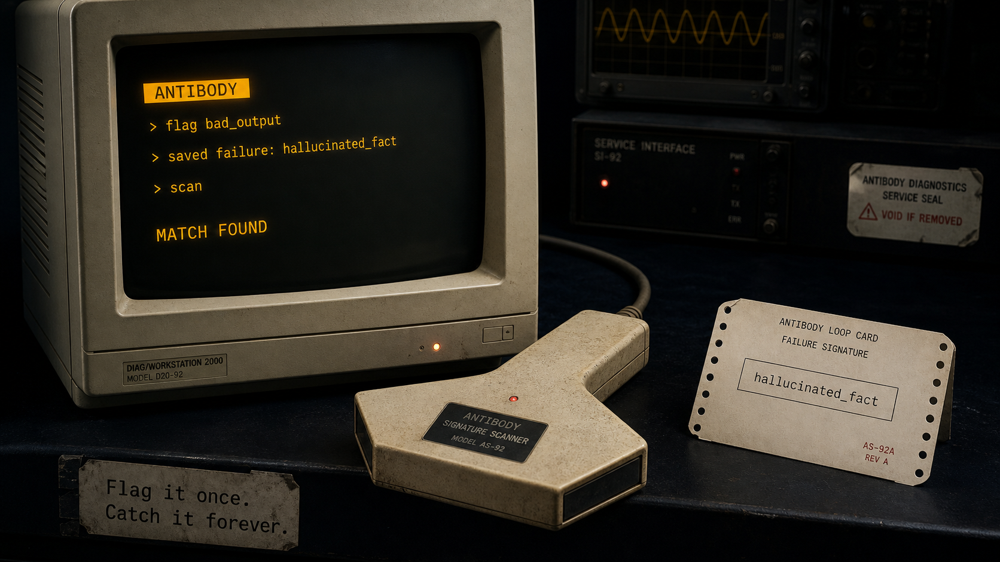
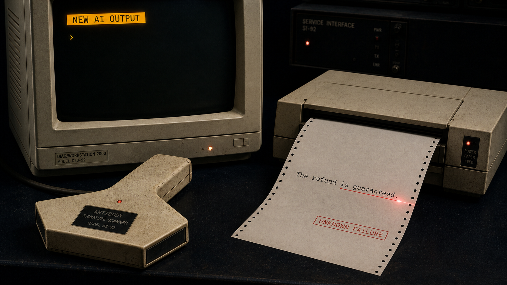
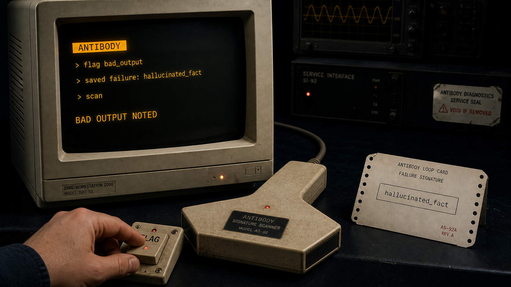
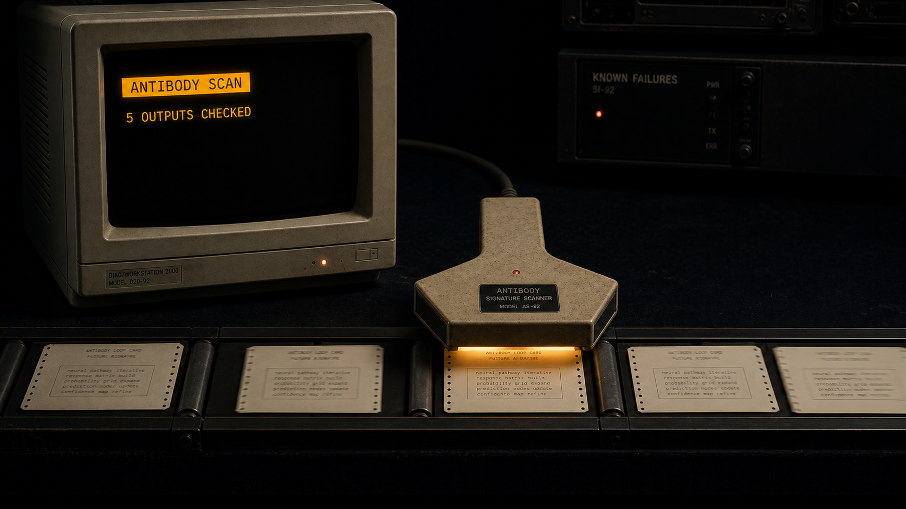
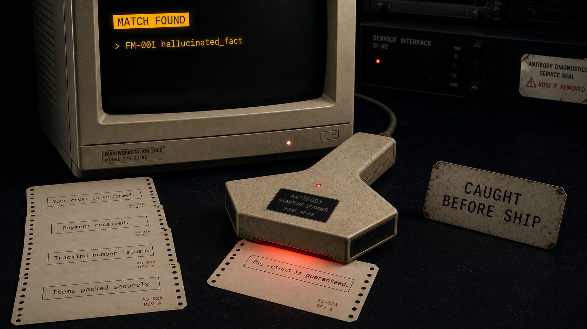
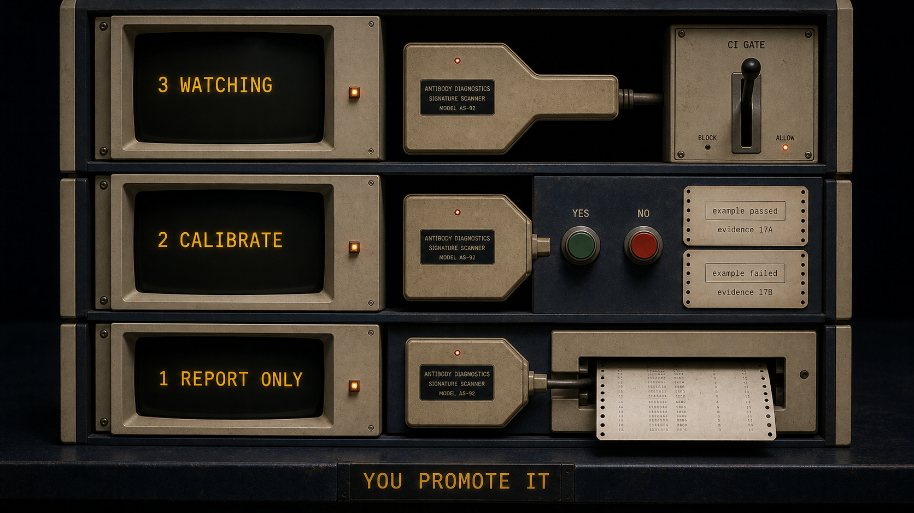
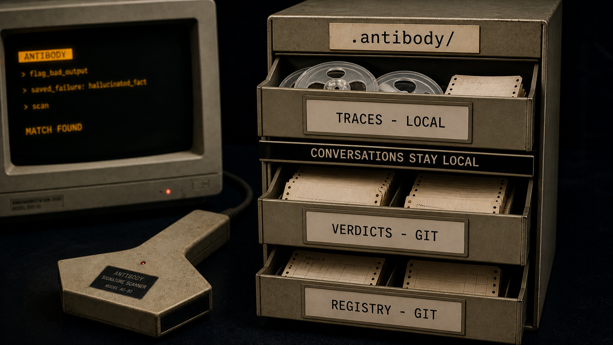

# 🚩 antibody

[](https://www.npmjs.com/package/antibody)
[](https://github.com/r3dbars/antibody/actions/workflows/test.yml)
[](LICENSE)

**AI evals made simple.** Flag a bad AI conversation once; antibody catches
that mistake every time it tries to come back.



Evals sound like a whole project — metrics, golden datasets, judge prompts,
dashboards. antibody skips all that. You read your agent's conversations and
flag the bad ones in your own words; it turns your flags into checkers and
runs them on everything, forever.

antibody is a small CLI plus a `.antibody/` folder in your repo. Traces,
verdicts, and failure patterns are all plain text files in git. No server,
no accounts, nothing leaves your machine.

## Flag it once. Catch it forever.

Your AI produces a bad answer. Antibody does not pretend to know that it is
bad until you flag it.



You name the problem in your own words. Antibody turns that judgment into a
durable failure signature.




From then on, future outputs pass through the scanner. If the same kind of
mistake returns, Antibody catches it before you ship.





## Try it

No install, no API key, runs in a throwaway folder:

```sh
npx antibody demo
```


## Use it on your agent

```sh
cd your-agent-project && npx antibody init
```

Then, whenever you have fresh conversations:

```sh
npx antibody import logs/  # JSON/JSONL, most message shapes work
npx antibody review        # localhost queue: flag what's bad, in your words
npx antibody distill       # flags → named failure patterns
npx antibody scan          # exit 1 if a known mistake came back
```

Put `scan` in CI and the mistakes you've flagged stay caught.

Using Claude Code or another coding agent? Skip the commands — [`skills/`](skills/)
teach it the loop. Say: *"install antibody in this project and review my
agent's traces."*

## What a failure pattern looks like

Each flag you make distills into a file like this in
`.antibody/registry/` — readable, diffable, code-reviewable:

```markdown
---
id: FM-001
name: replies-instead-of-continuing
status: calibrating        # report-only until you promote it
examples:
  - trace: tr-9ffc4d8ce646
    note: "suggested the assistant's reply while I was typing the user side"
checker:
  type: rule               # rule = regex, free; judge = LLM call
  pattern: "^(I['']?m not sure|I apologi[sz]e)"
---

## Description

While the owner types the user side of a chat, the suggestion answers them
instead of continuing their sentence.
```

## Checkers earn trust; you stay the judge



Checkers can be wrong, so new ones can't gate anything:

- New patterns start report-only. Their hits show up in `review` as
  one-keypress accept/dismiss questions.
- Every accept/dismiss doubles as a calibration label. `npx antibody
  calibrate` shows each checker's agreement with you (TPR/TNR included).
- Promotion is manual: edit `status: watching` in the pattern file and
  commit. Only `watching` patterns can fail a build.

## Teams



State is text files in git, one verdict file per reviewer — syncing is
`git pull`, no merge conflicts by construction. Verdict files contain trace
fingerprints and judgments, not conversation content, so committing them
doesn't put transcripts in your repo.

## Rough edges

- `rule` checkers are free and run anywhere; `judge` checkers need
  `ANTHROPIC_API_KEY` (or a coding agent driving the loop via `skills/`).
- Calibration needs labels — expect ~10+ verdicts on a pattern before its
  score means much. Don't promote before that.
- `import` handles most JSON/JSONL message shapes; Claude Code session
  transcripts need an adapter (planned).
- Changing a trace's text changes its fingerprint — re-exporting the same
  conversations with different formatting imports them as new traces.

## Background

antibody is [Hamel Husain & Shreya Shankar's evals
FAQ](https://hamel.dev/blog/posts/evals-faq/) error-analysis loop, packaged.
Directly inspired by Shreya's
[error-discovery-skill](https://github.com/shreyashankar/error-discovery-skill);
antibody imports its annotations (`npx antibody import --annotations`).
File formats are specified in [`spec/`](spec/).

MIT licensed.
