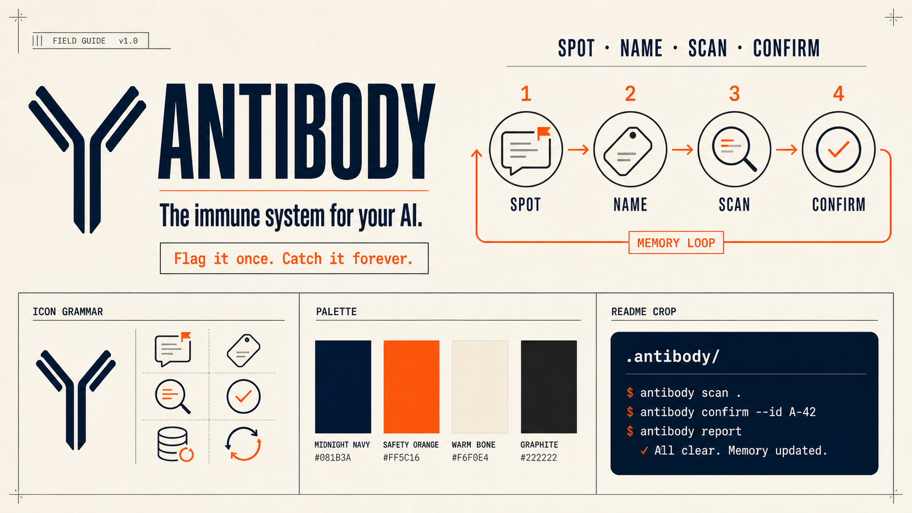
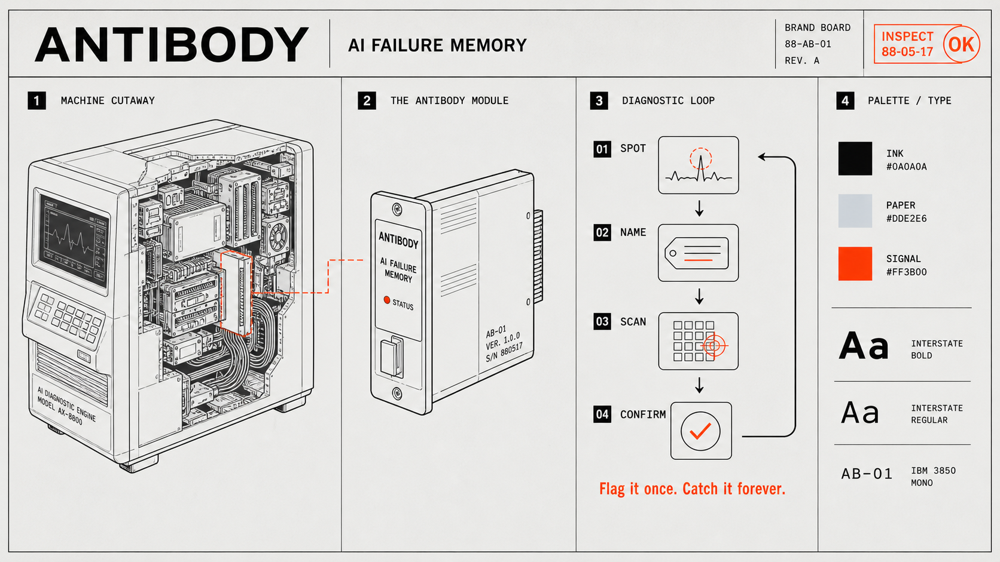
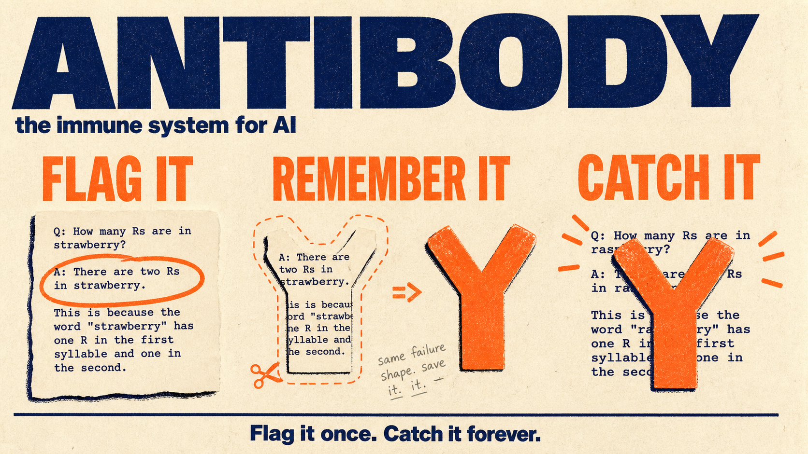

# Antibody visual mood board

Antibody is **the immune system for your AI**.

The visual system should feel clear, technical, memorable, and approachable to software developers who are new to evals.

## 1. Developer field guide

The most complete identity system: editorial hierarchy, a simple four-step loop, a compact icon language, and a developer-native CLI surface.

## 2. Diagnostic manual

The strongest core direction: Antibody becomes a small diagnostic module inside an AI system. It is technical without looking like another SaaS dashboard.

## 3. CRT diagnostic workstation

The strongest hero direction: a physical failure-signature scanner makes the product metaphor tangible and distinctive.

## 4. Two-ink developer zine

The simplest storytelling direction: flag the failure, remember its shape, and catch it when it returns.

## Recommended direction

Use the **diagnostic manual** as the primary visual language, borrow the **CRT workstation** for the README hero, and use the **developer zine's simplicity** for the working loop, trust ladder, and `.antibody/` file-boundary explainers.

