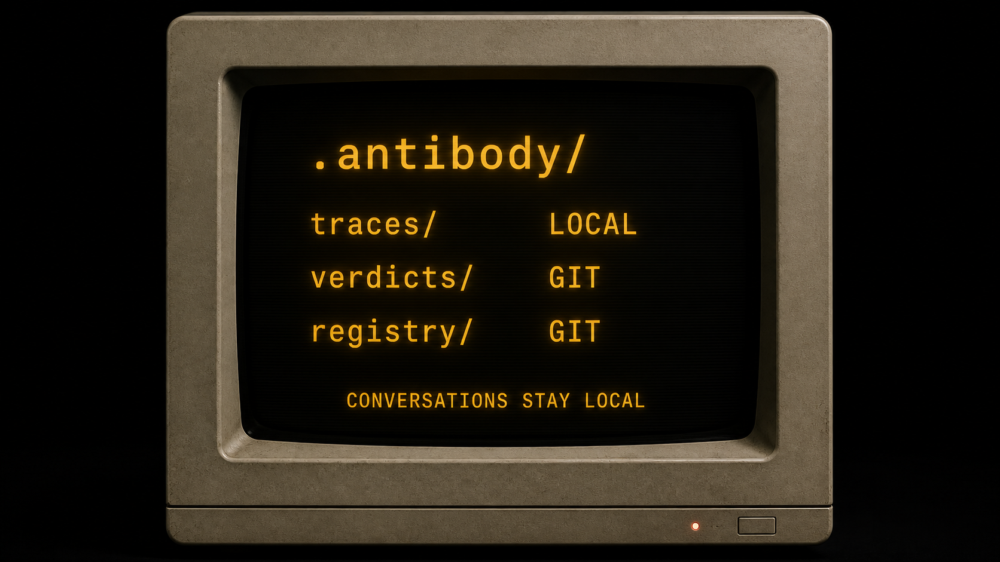

# Antibody visual story

Antibody is a physical failure-signature scanner for your AI system.

## 0. The diagnostic workstation

## 1. A new failure appears

Your AI produces a bad answer. Antibody does not pretend to know that it is bad yet.

## 2. You flag it

You are the judge. Mark the output and describe what went wrong in your own words.

## 3. Antibody remembers it

The flag becomes a named, reviewable failure pattern in the registry.

## 4. Every future run is scanned

New outputs pass through the same known-failure scanner.

## 5. The mistake tries to return

Antibody recognizes the signature and catches it before you ship.

## 6. Checkers earn trust

New checkers start report-only, calibrate against your decisions, and gate CI only after you promote them.

## 7. The boundary stays clear

Conversation traces remain local. Fingerprints, verdicts, and failure patterns can live in git.

